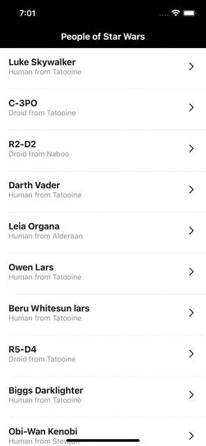
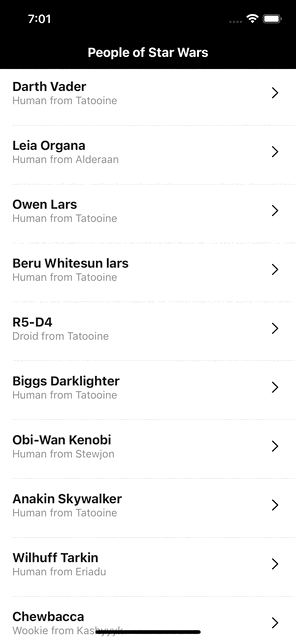

# Ravn-Challenge-V2-DanielCornejo

## Description

This is Daniel Cornejo's code challenge for Ravn's iOS position.

The app was built using **SwiftUI 2.0** and **Swift 5.3**. In order to run this on a phone, it has to be upgraded to at least **iOS 14.0**.

## Setup

### Requirements

- You must use Xcode 12.5 or superior

### Running Instructions

1. Download the project
2. Open **Ravn-Challenge-V2-DanielCornejo.xcodeproj** 
3. Wait until all dependencies are installed 
4. Run the app on a device (whether simulator or physical device)

## Technical Details

### Development

- MVVM architectural pattern.
- Swift.
- SwiftUI framework for the UI.

### Dependencies

The applications uses [SPM](https://swift.org/package-manager/) (Swift Package Manager) for managing dependencies.

Installed Dependencies:

- [Apollo iOS](https://github.com/apollographql/apollo-ios): a strongly-typed, caching GraphQL client for iOS, written in Swift.
- [CombineExt](https://github.com/CombineCommunity/CombineExt): a collection of operators, publishers and utilities for Combine, that
are not provided by Apple themselves, but are common in other Reactive
Frameworks and standards.

### Assumptions

- The application only support Light Mode for the UI
- Only people is going to fetched from the API

## Demo

### Fetching List:

### Detail:

### Pagination:

